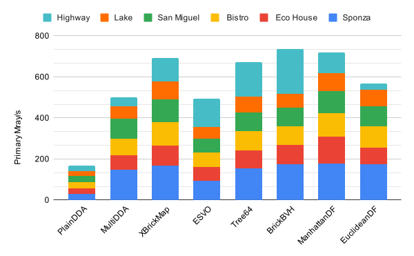
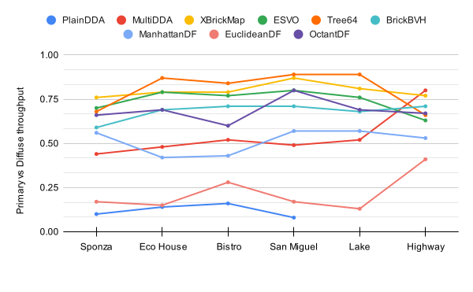
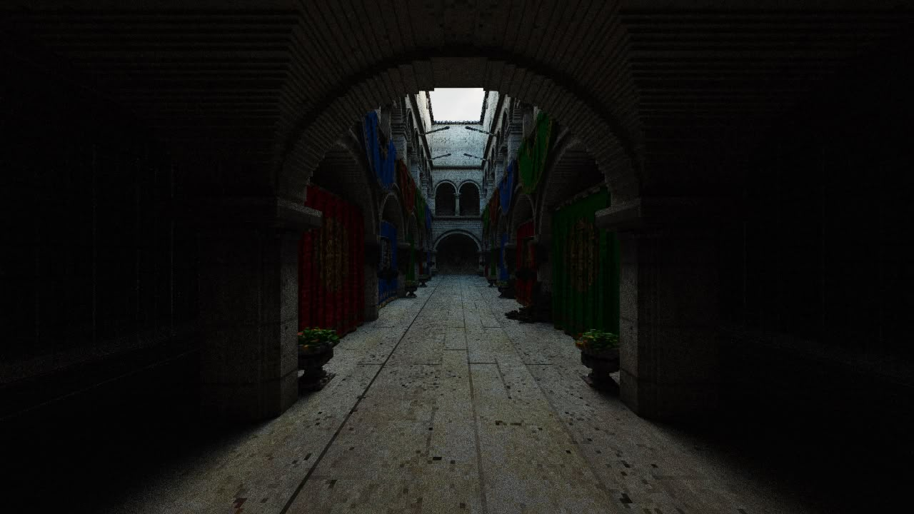
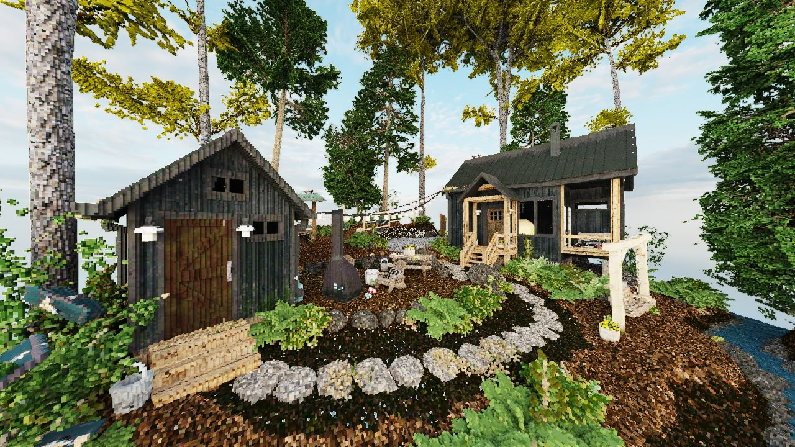
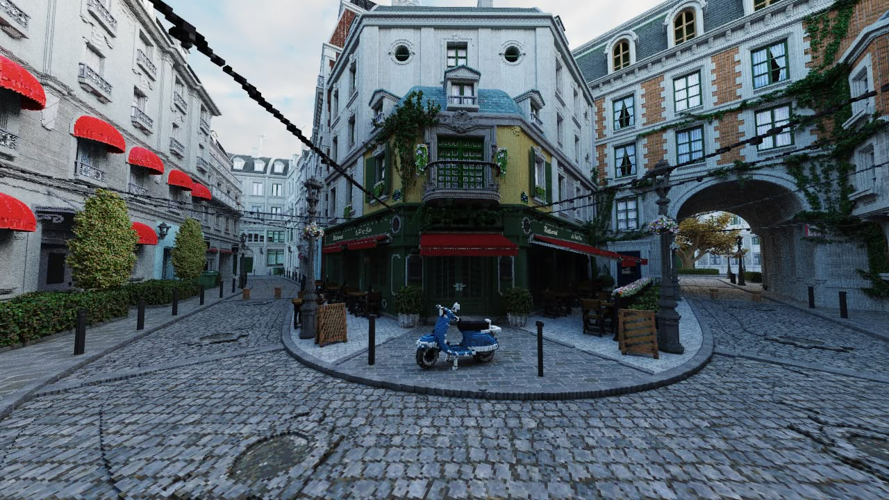
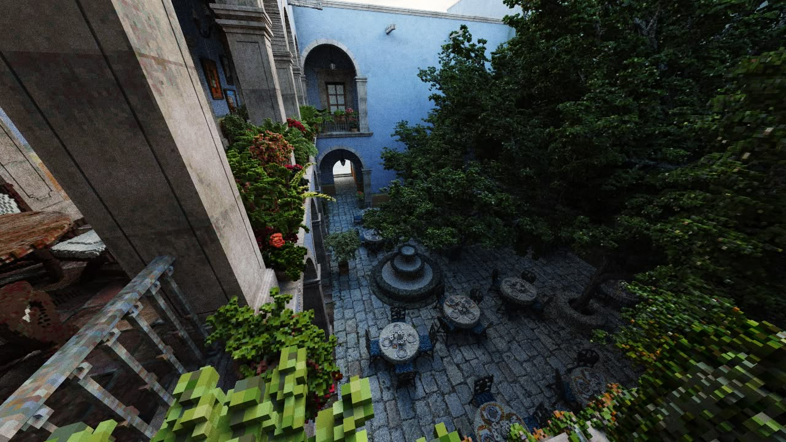
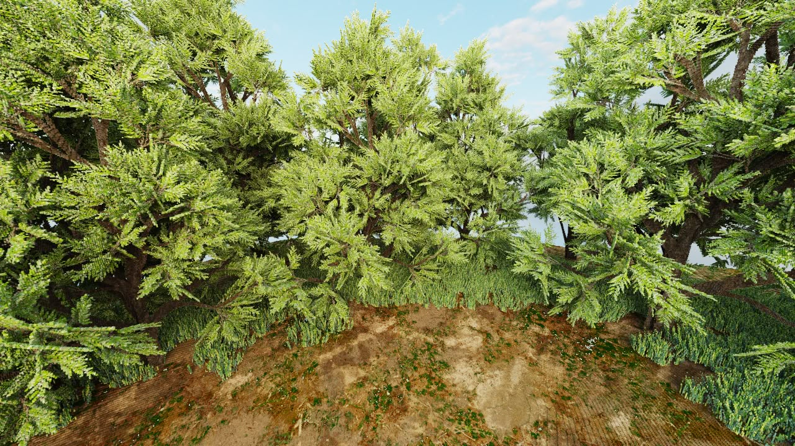
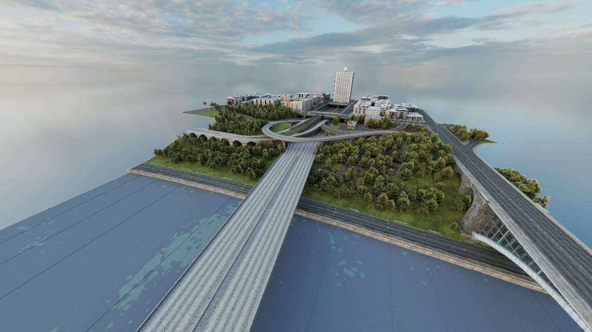

# VoxelRT
Voxel rendering experiments

## Benchmark of acceleration structures

### Implementations
- PlainDDA: Incremental DDA over flat grid
- MultiDDA: Incremental DDA over 2-level grid (8³ bricks)
- eXtendedBrickMap: Space skipping over 3-level grid + 4³ occupancy bitmasks (4³ sectors -> 8³ bricks)
- ManhattanDF/EuclideanDF: Space skipping over tiled 256³ distance fields at 1:4 resolution + 4³ occupancy bitmasks
- OctantDF: Space skipping over tiled 256³ 8-directional distance fields at 1:4 resolution + 4³ occupancy bitmasks
- ESVO: Port of "Efficient Sparse Voxel Octrees", no contours, no beam optimization
- Tree64: Sparse voxel 4³-tree
- StdBVH: Standard binary BVH + DDA over 8³ brick leafs

TODO:
- CWBVH: Compressed 8-wide BVH + DDA over 8³ brick leafs

### Characteristics

| Method    | Accel method  | Mem cost (impl) |Edit cost | Advantages            | Drawbacks         |
|-----------|---------------|---------------|---------------|-----------------------|-------------------|
| PlainDDA  | none          | 1 bit per 1³  | O(1)          | good start point      |not fast enough    |
| MultiDDA  | space part    | 1 bit per 1³ +<br>1 bit per 8³  | O(1)          | good perf rel.<br> simplicity |simd divergence    |
| XBrickMap | space part    | 8³ bits per brick +<br> 12 bytes per sector | ~O(1), *1| ? | ?   |
| ManhattanDF| ray march    | 1 byte per 4³ +<br> 1 bit per 1³ | O(m)    | ?     | mem/gen cost |
| EuclideanDF| ray march    | 2 bytes per 4³ +<br> 1 bit per 1³ | O(m)    | ?     | mem/gen cost |
| OctantDF   | ray march    | 8 bytes per 4³ +<br> 1 bit per 1³ | O(m)    | ?     | mem/gen cost |
| ESVO      | space part    | ~4 bytes per node | ~O(log m), *2   | contours?        | ~~hard to edit~~      |
| Tree64    | space part    | 12 bytes per node | ~O(log m), *2   | lower overhead<br>vs octrees | ~~hard to edit~~ |
| StdBVH  | geom part       | 16 bytes per node +<br> 8³ bits per brick | ?         | flexible, <br>widely researched | ?       |
| CWBVH   | geom part       | 80 bytes per node +<br> 8³ bits per brick | ?         | TBD                    | ?       |

- *1: XBrickMap supports arbitrary edits within a brick, but insertions and deletions may require reallocations at sector level to make space for new bricks.
- *2: Sparse trees can be more easily edited by [path copying](https://en.wikipedia.org/wiki/Persistent_data_structure#Path_copying), taking logarithmic time complexity. This is not implemented in this project, but a Rust implementation is available here: https://github.com/expenses/tree64

---

### Results

TL;DR:



Throughput ratio for primary rays vs +1 bounce diffuse:



---

Labels:
- `Mrays/s`: million ray casts per second
- `Mrays/s PT1`: total mrays over 1 primary + 1 diffuse bounce
- `Iters/ray`: average number of traversal iterations per ray
- `Clocks/iter`: average GPU clocks per traversal iteration (based on subgroup `clockARB()`)
- `Sync`: upload and initialization cost of GPU buffers (per scene, not super accurate. Voxel materials only implemented in XBrickMap and Tree64)

All tests were run on an integrated GPU. I guesstimate at least 5-10x throughput on real hardware.

--------

**Scene**: Sponza 2k (499k * 8³ voxels)
|Method      |Mrays/s     |Mrays/s PT1 |Iters/ray   |Clocks/iter |GPU sync    |CPU sync    |
|------------|------------|------------|------------|------------|------------|------------
|PlainDDA    |31.4        |3.2 (0.10x) |391.7       |67.8        |133.2 ms    |44.3 ms     |
|MultiDDA    |147.7       |64.6 (0.44x)|58.1        |79.1        |148.1 ms    |37.4 ms     |
|XBrickMap   |165.6       |125.1 (0.76x)|19.2        |186.9       |171.8 ms    |150.5 ms    |
|ESVO        |95.0        |66.2 (0.70x)|46.9        |148.3       |0.0 ms      |652.7 ms    |
|Tree64      |182.6       |124.2 (0.68x)|19.9        |170.7       |0.0 ms      |1318.2 ms   |
|StdBVH    |175.0       |102 (0.59x)|27.3        |123.6       |0.0 ms      |490.3 ms    |
|ManhattanDF |166.3       |93.2 (0.56x)|34.3        |106.7       |1003.1 ms   |608.3 ms    |
|EuclideanDF |174.3       |30.0 (0.17x)|39.7        |97.2        |1476.6 ms   |755.0 ms    |
|OctantDF    |129.0       |84.9 (0.66x)|31.1        |168.5       |475.9 ms    |656.5 ms    |

--------

**Scene**: Eco House 2k (448k * 8³ voxels)
|Method      |Mrays/s     |Mrays/s PT1 |Iters/ray   |Clocks/iter |GPU sync    |CPU sync    |
|------------|------------|------------|------------|------------|------------|------------
|PlainDDA    |26.4        |3.8 (0.14x) |434.7       |69.7        |128.5 ms    |35.6 ms     |
|MultiDDA    |71.4        |34.6 (0.48x)|112.6       |89.0        |148.6 ms    |33.2 ms     |
|XBrickMap   |96.3        |76.5 (0.79x)|27.8        |239.1       |117.7 ms    |129.6 ms    |
|ESVO        |67.1        |52.7 (0.79x)|59.9        |170.8       |0.0 ms      |651.2 ms    |
|Tree64      |107.5       |93.9 (0.87x)|26.8        |231.1       |0.0 ms      |1371.3 ms   |
|StdBVH    |91.5        |63 (0.69x)|33.2        |212.6       |0.0 ms      |510.4 ms    |
|ManhattanDF |132.0       |55.8 (0.42x)|34.3        |149.5       |638.3 ms    |379.0 ms    |
|EuclideanDF |84.5        |12.5 (0.15x)|45.2        |196.0       |1041.3 ms   |446.6 ms    |
|OctantDF    |99.3        |69.0 (0.69x)|28.4        |225.2       |316.0 ms    |423.8 ms    |

--------

**Scene**: Bistro 4k (975k * 8³ voxels)
|Method      |Mrays/s     |Mrays/s PT1 |Iters/ray   |Clocks/iter |GPU sync    |CPU sync    |
|------------|------------|------------|------------|------------|------------|------------
|PlainDDA    |27.7        |4.4 (0.16x) |436.4       |67.9        |164.2 ms    |122.1 ms    |
|MultiDDA    |79.3        |41.3 (0.52x)|107.4       |82.3        |151.3 ms    |87.0 ms     |
|XBrickMap   |109.6       |87.0 (0.79x)|27.9        |205.6       |216.9 ms    |191.9 ms    |
|ESVO        |67.9        |52.5 (0.77x)|71.1        |141.3       |0.0 ms      |1308.4 ms   |
|Tree64      |109.7       |92.6 (0.84x)|30.9        |193.3       |0.0 ms      |2011.6 ms   |
|StdBVH    |88.3        |63 (0.71x)|50.4        |146.0       |0.0 ms      |1109.2 ms   |
|ManhattanDF |109.8       |47.4 (0.43x)|53.8        |115.2       |2119.2 ms   |1331.7 ms   |
|EuclideanDF |101.1       |28.5 (0.28x)|66.6        |105.4       |2897.5 ms   |1235.0 ms   |
|OctantDF    |87.8        |53.0 (0.60x)|41.4        |192.0       |1101.6 ms   |1486.3 ms   |

--------

**Scene**: San Miguel 4k (681k * 8³ voxels)
|Method      |Mrays/s     |Mrays/s PT1 |Iters/ray   |Clocks/iter |GPU sync    |CPU sync    |
|------------|------------|------------|------------|------------|------------|------------
|PlainDDA    |33.1        |2.6 (0.08x) |354.3       |69.0        |141.9 ms    |59.9 ms     |
|MultiDDA    |97.2        |48.0 (0.49x)|66.2        |106.3       |158.3 ms    |53.7 ms     |
|XBrickMap   |109.8       |95.7 (0.87x)|25.2        |226.0       |168.6 ms    |152.4 ms    |
|ESVO        |67.9        |54.5 (0.80x)|68.4        |147.1       |0.0 ms      |818.1 ms    |
|Tree64      |112.1       |99.5 (0.89x)|28.8        |205.7       |0.7 ms      |1453.9 ms   |
|StdBVH    |88.0        |62 (0.71x)|42.7        |171.3       |0.0 ms      |717.8 ms    |
|ManhattanDF |105.0       |60.1 (0.57x)|48.3        |132.3       |819.2 ms    |774.2 ms    |
|EuclideanDF |99.0        |16.9 (0.17x)|60.9        |115.6       |1905.2 ms   |661.4 ms    |
|OctantDF    |82.2        |65.8 (0.80x)|37.7        |217.4       |593.9 ms    |753.2 ms    |

--------

**Scene**: Forest Lake 2k (807k * 8³ voxels)
|Method      |Mrays/s     |Mrays/s PT1 |Iters/ray   |Clocks/iter |GPU sync    |CPU sync    |
|------------|------------|------------|------------|------------|------------|------------
|PlainDDA    |23.6        |23.2 (0.99x)|510.4       |67.5        |154.7 ms    |74.4 ms     |
|MultiDDA    |60.6        |31.4 (0.52x)|119.7       |101.1       |134.8 ms    |110.5 ms    |
|XBrickMap   |88.8        |71.6 (0.81x)|26.2        |278.1       |170.4 ms    |218.7 ms    |
|ESVO        |57.4        |43.5 (0.76x)|63.3        |189.3       |0.0 ms      |1202.1 ms   |
|Tree64      |93.1        |83.3 (0.89x)|27.4        |262.6       |0.0 ms      |1692.5 ms   |
|StdBVH    |68.7        |46 (0.68x)|41.5        |238.9       |0.0 ms      |957.4 ms    |
|ManhattanDF |88.4        |50.7 (0.57x)|43.3        |179.4       |1131.9 ms   |767.6 ms    |
|EuclideanDF |80.2        |10.1 (0.13x)|56.7        |158.4       |1997.2 ms   |692.3 ms    |
|OctantDF    |71.0        |48.6 (0.69x)|35.0        |282.8       |605.5 ms    |786.3 ms    |

--------

**Scene**: NY Highway I95 4k (574k * 8³ voxels)
|Method      |Mrays/s     |Mrays/s PT1 |Iters/ray   |Clocks/iter |GPU sync    |CPU sync    |
|------------|------------|------------|------------|------------|------------|------------
|PlainDDA    |24.0        |23.8 (0.99x)|512.0       |67.4        |141.2 ms    |43.0 ms     |
|MultiDDA    |42.5        |34.1 (0.80x)|312.1       |59.3        |124.1 ms    |50.0 ms     |
|XBrickMap   |115.2       |88.5 (0.77x)|31.3        |181.9       |136.1 ms    |144.7 ms    |
|ESVO        |136.9       |86.4 (0.63x)|33.2        |139.0       |0.0 ms      |719.0 ms    |
|Tree64      |208.9       |137.4 (0.66x)|16.0        |186.8       |0.0 ms      |1433.0 ms   |
|StdBVH    |215.9       |154 (0.71x)|14.2        |174.1       |0.0 ms      |571.7 ms    |
|ManhattanDF |100.3       |53.0 (0.53x)|26.2        |250.2       |916.4 ms    |943.8 ms    |
|EuclideanDF |27.4        |11.1 (0.41x)|29.0        |870.8       |2477.6 ms   |814.6 ms    |
|OctantDF    |131.2       |87.8 (0.67x)|24.9        |198.1       |723.5 ms    |915.5 ms    |

---

Scene refs:

<p float="left">
    
    
    
    <br>
    
    
    
</p>

### Cursory overview and observations
MultiDDA is a simple brickmap implementation that uses two nested DDA traversal loops to perform space skipping, one at 8³ scale and the other at voxel scale. Despite its simplicity, it performs surprisingly well relative to other techniques when considering only primary rays, and even though skips are limited to only one scale.

The poor performance with incoherent rays happens due to control-flow divergence when entering the inner traversal loop, since not all SIMD lanes will hit a brick at the same time as the others and thus become "stalled" for the duration of the inner loop. Other methods are not immune to incoherent rays due to poor memory access patterns, but divergence in this particular case has a significant impact.

I tried to mitigate divergence in two ways by following ideas from BVH traversal literature, without much success. The first attempt was to use wave intrinsics to postpone the inner traversal until enough lanes were active; the second, was to un-nest and pair the DDA loops, such that the inner DDA runs only after the brick DDA finds a hit, following control flow re-convergence.

---

XBrickMap attempts to improve on the idea of skipping through multiple grid levels by taking advantage of tiled bitmasks to perform more general hierarchical skips, using bitwise tests to identify sub-sections of empty voxels (as in 4³, 2³, 1³ cuboids). The bitmasks are also used to omit empty bricks within each sector (left-packing) for additional memory savings. Random access is made possible by using _popcnt_ instructions to count the number of preeceding entries at any given index.

Traversal was implemented using an algorithm similar to ray marching. At each iteration, voxel positions are computed by intersecting with the three back-facing cube planes, then the brickmap layers are queried in order to determine the step size. This is simpler and more efficient than DDA variants for stepping by arbitrary amounts, but requires workarounds such as biasing the intersection distances to prevent infinite backtracking due to floating-point limitations.

---

Ray marching through distance fields is another very simple and intuitive traversal method, but the naive approach of storing one distance value per voxel is impractical for bigger grids due to the associated memory and especially bandwidth costs, the latter which becomes problematic even for primary rays as they lose coherence the furthest they get from origin. Moreover, traversal is not considerably shorter than that of methods relying on space partitioning (~8%), and pre-processing has a significant cost (10x more GPU time than XBrickMap).

Memory costs can be reduced by lowering the field resolution, without much detriment to traversal efficiency. Following the theme of 64-bit masks, I picked 1:4 scale (one distance value per 64 voxels) combined with occupancy masks for the final implementation. The masks are queried whenever sampled distance values are zero.

Dense areas with fine geometry (like foliage) are worst cases for ray traversal because they cause grazing rays to advance slowly, motivating the idea of "directional" or "anisotropic" distance fields. OctantDF implements this idea by creating 8 separate manhattan fields that each consider only voxels ahead of the associated ray octant direction (in other words, distances are only propagated across rows of opposing axis directions in respect to the octant). Compared to traditional distance fields, it lowers the overall number of iterations by ~20-25%, and increases throughput for incoherent rays by ~30-50% (why though?) - but ultimately it is still much worse than space-partitioning methods.

---

I have not closely inspected the performance characteristics of ESVO, but believe the main reason for its underwhelming performance is the fact that it takes many extra iterations to ascend and descend the tree and advance positions by DDA. Given that it was primarily designed to encode smooth surfaces, other approaches for octree traversal [[C. Crassin et al, 2009]](https://inria.hal.science/inria-00345899/file/CNLE09.pdf), [[V. Havran, 1999]](https://www.researchgate.net/publication/245091894_A_Summary_of_Octree_Ray_Traversal_Algorithms) could offer better performance.

Despite, the throughput ratio for incoherent rays is comparable to others, possibly due to low memory bandwidth, given that nodes are very small (4 bytes each) and localized (building tree in depth first order results in a z-curve layout).

The traversal is a near 1:1 port of the original ESVO implementation, and only node encoding was changed: relative pointers are "backwards" to allow for trees to be built without intermediate buffers (i.e. parent nodes appear after their children), and far pointers are signaled by a reserved upper range rather than a dedicated bit.

---

The two main advantages wide 4³ trees have over standard octrees are the overall shallower trees and lower overhead per voxel. Based on rudimentary tests, I found that most scenes consume about half as much memory as ESVO.

Traversal was at first implemented using top-down recursive DDA over bitmasks of each node, which performed around 11-15% faster than ESVO for primary rays.

Like in XBrickMap, I found that a ray marching algorithm was both simpler and faster, as it benefits from bitmasks for longer ray steps and is less prone to divergence. Initially, this performed very close to XBrickMap but did not surpass it until the two following optimizations (which combined, summed up to an 18% improvement).

Further using group-shared memory for the ancestor node stack resulted in ~9% speedup compared to a "local" array variable (this trick had a surprisingly negative impact when applied to ESVO which was 120% slower, presumably due to its 4x bigger stack).

Mirroring the coordinate system to the negative ray octant resulted in another 11% bump due to simplified intersection calculations (no need to offset face planes, simplified node bounds clamping).

Apart from increased memory efficiency due to sparseness, the most interesting advantage trees have over grids might be support for arbitrary voxel scales and sub-divisions, as in dynamic details. Apart from LOD streaming, this could also be useful for things like instancing and animations, which can be implemented by simply indirecting leafs to different subtrees.

---

BVHs have several advantages over all other methods. First, they are industry standard and have been extensively researched, and are quickly gaining hardware acceleration support. They are not limited to voxels and support traditional triangle-based geometry, transformations, and reasonably efficient updates.

TODO: expand

---

Rasterization without LODs is vastly inefficient with small voxels due to the huge amount of primitives generated. Greedy meshing does not seem to provide significant improvements (~15%) unless the number of materials is very limited or decoupled from the mesh, and voxels form long spans of columns or flat planes (~30%-20x). Although, even Sponza at 1k³ resolution with meshing in 62³ chunks and a single material is nearly in the order of a million quads.

TODO: provide actual numbers, adhoc impl does not integrate with benchmark runner because it has nothing to do with rt?

### Misc refs
- ["Efficient Sparse Voxel Octrees"](https://research.nvidia.com/publication/2010-02_efficient-sparse-voxel-octrees-analysis-extensions-and-implementation) - Samuli Laine, Tero Karras
- ["A Survey on Bounding Volume Hierarchies for Ray Tracing"](https://meistdan.github.io/publications/bvh_star/paper.pdf) - Daniel Meister, Shinji Ogaki, Carsten Benthin, Michael J. Doyle, Michael Guthe, Jiří Bittner
- [Real-time Ray tracing and Editing of Large Voxel Scenes](https://studenttheses.uu.nl/handle/20.500.12932/20460) - Thijs van Wingerden
- ["A high performance realtime CUDA voxel [brick map] path tracer"](https://github.com/stijnherfst/BrickMap) - stijnherfst
- ["Binary Greedy Meshing"](https://github.com/cgerikj/binary-greedy-meshing) - cgerikj

## Gallery
<table>
    <tr>
        <td>  </td>
        <td>  </td>
    </tr>
    <tr>
        <td>  </td>
        <td>  </td>
    </tr>
</table>

_Early screenshots of the CPU(bottom) and GPU(top) renderers, with 2-bounce diffuse lighting._

## Building
Build requirements: CMake, Clang, Vulkan SDK. (clang-cl shipped with Visual Studio might also work.)  
Run requirements: Vulkan 1.3 and AVX2.

```
cmake -S ./src -B ./build -DCMAKE_CXX_COMPILER=clang-18 -DCMAKE_C_COMPILER=clang-18 -DCMAKE_BUILD_TYPE=RelWithDebInfo
cmake --build ./build

./build/VoxelRT/VoxelRT.exe
```
