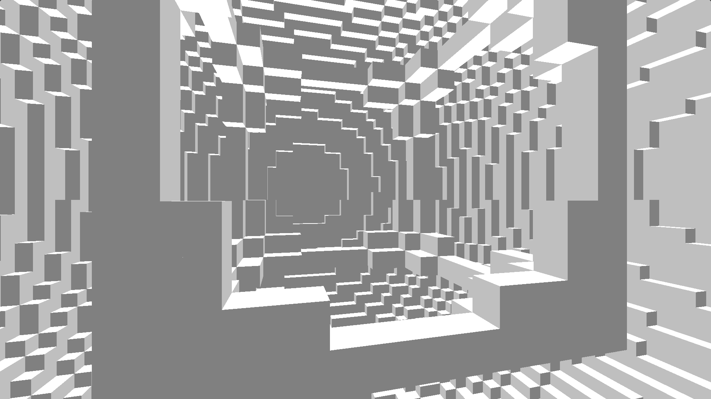
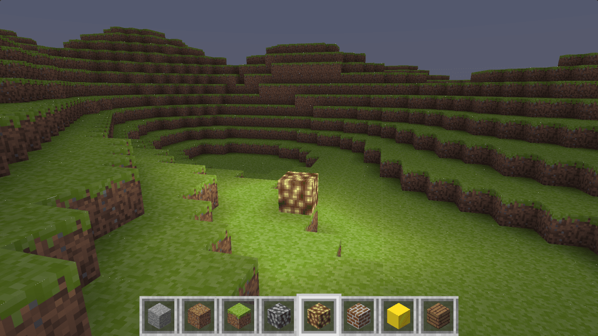
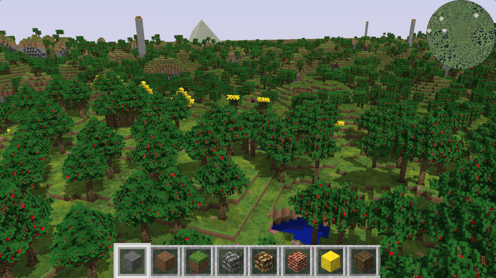
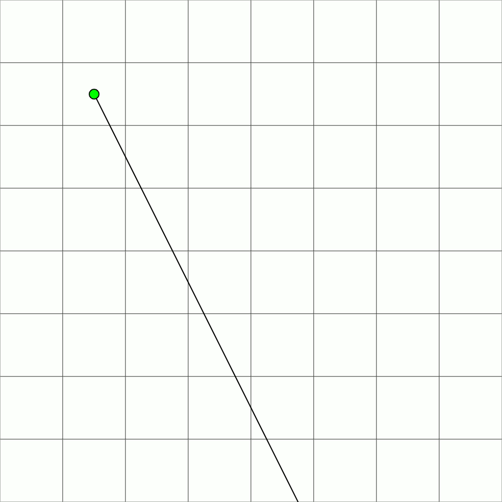
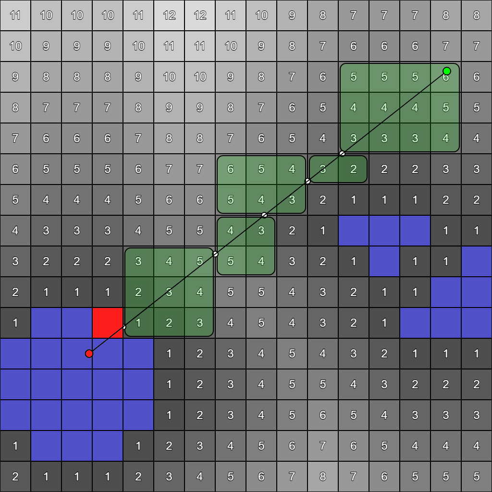
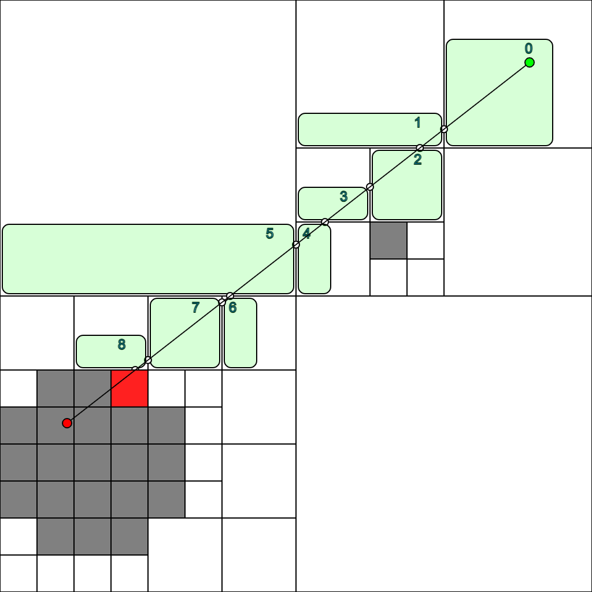
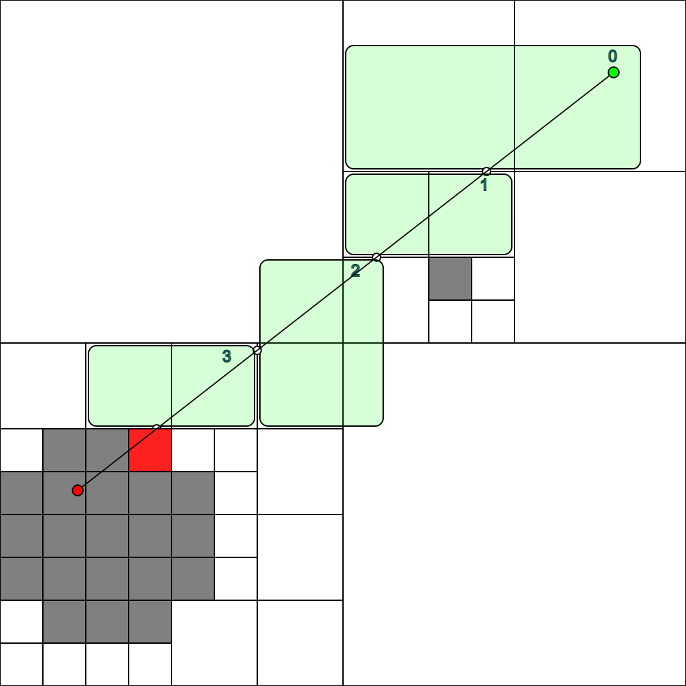
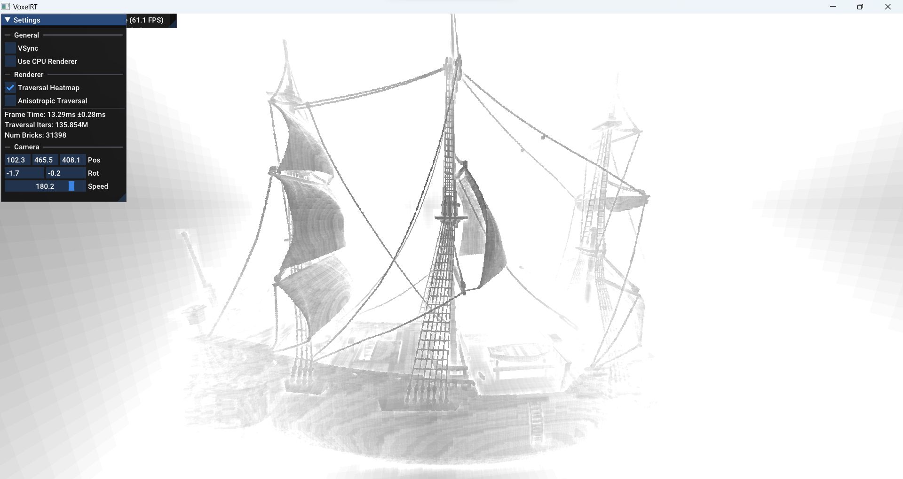
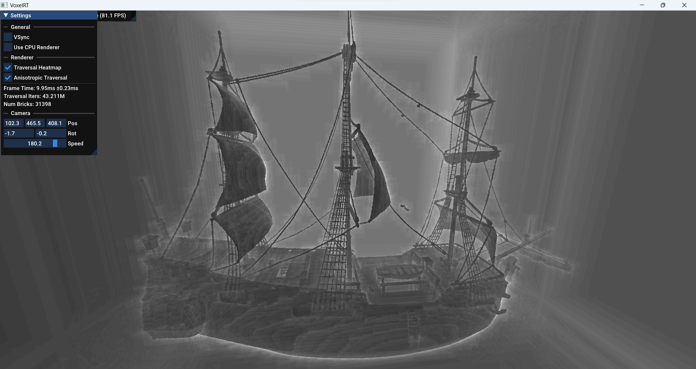

# Voxel ray tracing notes

**Key points:**
- Parametric voxel traversal algorithm (as per [ESVO](#sparse-voxel-octrees-svos) and [ADT07])
  - Easy to accelerate with space skipping
  - Faster than standard incremental DDA
- 64-bit occupancy bitmasks within 4x4x4 tiles
  - Useful for sparse storage allocation and space skipping LODs
  - Provides up to 3 LODs with a single 64-bit access

---

A natural approach for rendering voxels on a GPU is by using meshes. It's a proven method that works reasonably well and is very flexible, but can be complicated to scale up - think LODs, draw calls, buffer management, overdraw, chunk occlusion, greedy meshing (and its too many curses) ...the kind of stuff that actually makes for a pretty good way to learn graphics APIs and programming, if you manage to keep your sanity during the process I guess.

Ray tracing is not easier to implement efficiently either ~~(big revelation)~~, but conceptually much simpler and allows for very nice looking (and expansive) lighting effects. Even without any acceleration structures, it can be surprisingly fast, as demonstrated by these remarkable shadertoys:

<table align="center">
    <tr align="center">
        <td width="33%">
            <a href="https://www.shadertoy.com/view/4dX3zl"> </a> <br/>
            <p>Branchless Voxel Raycasting</p>
        </td>
        <td width="33%">
            <a href="https://www.shadertoy.com/view/MtcGDH">  </a> <br/>
            <p>[SH16C] Voxel Game</p>
        </td>
        <td width="33%">
            <a href="https://www.shadertoy.com/view/wsByWV">   </a> <br/>
            <p>Voxel game Evolution</p>
        </td>
    </tr>
</table>

---

The classic way to ray trace voxels is by using the [Fast Voxel Traversal](https://github.com/cgyurgyik/fast-voxel-traversal-algorithm/blob/master/overview/FastVoxelTraversalOverview.md) algorithm, which is a simple DDA loop that incrementally traverses through all intersecting voxels by comparing plane intersection distances and stepping through whichever side has progressed least at each iteration:

<div align="center">
  
  <p><i>2D DDA animation. <b>dx</b> and <b>dy</b> are the "side distances" or "tMax".</i></p>
</div>

Acceleration techniques based on space skipping relies on the ray tracer being able to step by variable amounts, which is not trivial to implement in the incremental DDA efficiently - most approaches I have seen are hybrids that look somewhat susceptible to thread divergence, like switching between ray marching and DDA, or nesting multi-level DDAs (which actually seems to be used by Teardown, so it's probably not that bad?).

On modern (decades old) hardware, floating-point multiply-adds are equally as cheap as individual adds or multiplies, so calculating the side distances per iteration isn't as much of a big deal as when the incremental algorithm was developed. Much like in the [slab AABB intersection algorithm](https://en.wikipedia.org/wiki/Slab_method), these distances can be computed efficiently by solving for the parametric equation `P(t) = origin + dir * t`.

This yields a relatively compact tracing function, that is actually slightly faster than the [incremental DDA](https://www.shadertoy.com/view/4dX3zl) even without any acceleration structures - or at least that's what my very [precarious benchmark](./sketches/dda_vs_parametric.glsl) suggests.

```glsl
bool rayTrace(vec3 origin, vec3 dir, out HitInfo hit) {
    vec3 invDir = 1.0 / dir;
    vec3 tStart = (step(0.0, dir) - origin) * invDir;
    ivec3 voxelPos = ivec3(floor(origin));

    for (uint i = 0; i < MAX_TRAVERSAL_ITERS; i++) {
        vec3 sideDist = tStart + vec3(voxelPos) * invDir;
        float tmin = min(min(sideDist.x, sideDist.y), sideDist.z) + 0.001;
        vec3 currPos = origin + tmin * dir;
        
        voxelPos = ivec3(floor(currPos));

        if (!isInBounds(voxelPos)) break;
        if (!getStepPos(voxelPos, dir)) {
            hit.mat = getVoxelMaterial(voxelPos);
            hit.pos = currPos;
            
            bvec3 sideMask = greaterThanEqual(vec3(tmin), sideDist);
            hit.uv = fract(mix(currPos.xz, currPos.yy, sideMask.xz));
            hit.norm = mix(vec3(0), -sign(dir), sideMask);
            return true;
        }
    }
    return false;
}
// Attempts to step `pos` by a safe amount.
// Returns false if inside a non-empty voxel.
bool getStepPos(inout ivec3 pos, vec3 dir) {
    return isEmptyVoxel(pos);
}
```

A few notes:
- The bias added to `tmin` is to workaround float precision limitations and ensure that the position always crosses through voxel boundaries, otherwise the ray will get stuck. This unfortunately leads to some artifacts around voxel edges (due to hit misses) that are especially visible at close-ups.
  - Another way to bias is to instead increment `voxelPos` by `sign(dir)` depending on `sideMask`. This eliminates all edge artifacts but doesn't prevent rays from getting stuck as coordiantes get bigger (leads to isolated pixel-size misses).
  - The [ESVO] implementation steps by manipulating the binary float representation directly, which presumably avoids any such issues, at the cost of being much harder to follow.
- The ray origin should be keept close to 0,0,0 to maximize available float precision, translation should be applied to the world instead (integer voxel coordinates). This can be done by offseting both `voxelPos` by `floor(actualCameraPos)` and ray origin by `fract(actualCameraPos)`. Translating the view-projection matrix instead of ray origin by the fraction will cause noticeable jittering artifacts when FOV is too low and mess up with temporal reprojection (mat4 precision seems to be way lower than I thought?).
- Rays originating from outside the grid need to be clipped to the grid bounds using an [AABB intersection algorithm](https://en.wikipedia.org/wiki/Slab_method).

## Acceleration structures
Voxel grids are usually very sparse, so most of the time spent by the ray tracer will be wasted stepping through empty space. There exists many acceleration techniques that help mitigate this issue and enable real-time tracing on even lower-end GPUs.

### Distance Fields (DFs)
Distance fields are perhaps the simplest such acceleration structure, and they're quite effective at it. The idea is that for every empty voxel, the distance to the nearest occupied voxel is stored along with it, so the ray tracer can step to a new position by offseting the current position along the ray based on that distance.

<div align="center">
  
</div>

DFs based on the Manhattan or Chebyshev metrics can be generated in linear complexity by propagating distances along individual rows over one pass per axis. A similar algorithm for generation of squared Euclidean DFs exists, but [PC94] shows that Manhattan DFs actually provide jump steps that are on average 3.7% longer than Euclidean DFs, leaving few reasons to bother using it.

```glsl
layout(r8ui) uniform uimage3D u_DistField;

uniform int u_Size;
uniform int u_Axis;

void initialize() {
    for (int i = 0; i < u_Size; i++) {
        ivec3 pos = ivec3(i, gl_GlobalInvocationID.xy);

        uint d = isEmptyVoxel(pos) ? 255 : 0;
        imageStore(u_DistField, pos, uvec4(d));
    }
}

#define PROPAGATE(_s) \
    for (int i = 1; i < u_Size; i++) {                                          \
        ivec3 pos = ivec3(i, gl_GlobalInvocationID.xy)._s;                      \
                                                                                \
        uint d = imageLoad(u_DistField, pos).r;                                 \
        d = min(d, imageLoad(u_DistField, pos - ivec3(1, 0, 0)._s).r + 1);      \
        imageStore(u_DistField, pos, uvec4(d));                                 \
    }                                                                           \
    for (int i = u_Size - 2; i >= 0; i--) {                                     \
        ivec3 pos = ivec3(i, gl_GlobalInvocationID.xy)._s;                      \
                                                                                \
        uint d = imageLoad(u_DistField, pos).r;                                 \
        d = min(d, imageLoad(u_DistField, pos + ivec3(1, 0, 0)._s).r + 1);      \
        imageStore(u_DistField, pos, uvec4(d));                                 \
    }                                                                           


layout(local_size_x = 8, local_size_y = 8, local_size_z = 1) in;
void main() {
    switch (u_Axis) {
        case 0: { initialize(); PROPAGATE(xyz); break; }
        case 1: {               PROPAGATE(yxz); break; }
        case 2: {               PROPAGATE(zyx); break; }
    }
}
```

Steps from non-Euclidean distances can be computed as follow:

```glsl
bool getStepPos(inout ivec3 pos, vec3 dir) {
    vec3 distScale = dir / (abs(dir.x) + abs(dir.y) + abs(dir.z));    // Manhattan
    vec3 distScale = dir / (max(dir.x, max(dir.y, dir.z));            // Chebyshev (untested)

    uint distToNearest = texelFetch(u_DistField, pos, 0).r;
    if (distToNearest > 0) {
        pos += ceil(distToNearest * distScale - step(0.0, dir));
        return true;
    }
    return false;
}
```

---

Ultimately, DFs are not quite well suitable for dynamic voxel scenes because mutations require recomputation of the entire DF or use of an iterative worklist algorithm for propagation between voxels/bricks up to a set distance limit. (Although they could also be isolated within individual bricks/sectors at the cost of decreased effectiveness.)

---

**Papers:**
- [RDT00]: [Fast ray-tracing of rectilinear volume data using distance transforms](https://www.researchgate.net/publication/3410902_Fast_ray-tracing_of_rectilinear_volume_data_using_distance_transforms)
- [ADT07]: [Accelerated regular grid traversals using extended anisotropic chessboard
distance fields on a parallel stream processor](https://www.sciencedirect.com/science/article/abs/pii/S0743731507001177)
- [PC94]: [Proximity clouds — an acceleration technique for 3D grid traversal](https://link.springer.com/article/10.1007/BF01900697)

[RDT00] and [ADT07] propose an interesting extension of DFs that helps mitigate the convergence issue around rays that are nearly parallel to voxels by building multiple DFs, each considering only voxels ahead of a specific direction octant. The memory and generation costs makes them not very practical for bigger scenes.

**Parabolic Euclidean Distance Transform:**
- https://prideout.net/blog/distance_fields/
- https://acko.net/blog/subpixel-distance-transform/
- https://github.com/seung-lab/euclidean-distance-transform-3d

### Occupancy Maps (OCMs)
These are simply bitmaps where each bit tells the presence of a voxel. Creating mipmaps of OCMs makes for a structure that is identical to octrees, but without all the indirection and sparseness.

They're cheap and trivial to generate, and still make for a very effective acceleration structure (but not quite as DFs). Here's a simple implementation in terms of `getStepPos()`:

```glsl
bool getStepPos(inout ivec3 pos, vec3 dir) {
    // Find highest empty LOD (mip level), k
    int k = 1;
    while (k < maxLevel && getOccupancy(pos >> k, k) == 0) {
        k++;
    }
    k--;
    if (k == 0) return false;

    // Align pos to border of LOD (round up or down depending on dir)
    int m = (1 << k) - 1;
    pos.x = dir.x < 0 ? (pos.x & ~m) : (pos.x | m);
    pos.y = dir.y < 0 ? (pos.y & ~m) : (pos.y | m);
    pos.z = dir.z < 0 ? (pos.z & ~m) : (pos.z | m);

    return true;
}
uint getOccupancy(ivec3 pos, int k) {
    // u_OccupancyStorage is a usampler3D of layout(r8ui), containing 2x2x2 voxels per byte.
    // Odd mips are redundant and can be evaluated by `cell != 0`, but requires multiple
    // textures or a custom buffer for actual memory savings.
    uint cell = texelFetch(u_OccupancyStorage, pos >> 1, k).r;
    uint idx = (pos.x & 1) | (pos.y & 1) << 1 | (pos.z & 1) << 2;
    return (cell >> idx) & 1;
}
```

An obvious inefficiency with this code is that it needs to search for the highest non-occupied mip from scratch on every iteration. The [ESVO](#sparse-voxel-octrees-svos) paper proposes the use of a stack to enter and leave octree nodes, but a similar optimization can be done more easily here by inlining getStepPos() and preserving the mip-level `k` between iterations, so the search can continue at the level found in the previous iteration. This also has the nice bonus that voxel materials only need to be queried at the end of traversal, saving precious memory bandwidth.

```glsl
    int k = 3; // arbitrary initial level
    for (int i = 0; i < MAX_TRAVERSAL_ITERS; i++) {
        // ...

        if (!isInBounds(voxelPos)) break;

        if (getOccupancy(voxelPos >> k, k) != 0) {
            while (--k >= 0 && getOccupancy(voxelPos >> k, k) != 0) ;
            if (k < 0) { /* ... found occupied voxel, end traversal */ return true; }
        } else {
            while (++k < maxLevel && getOccupancy(voxelPos >> k, k) == 0) ;
            k--;
        }
    }
```

(These guarded loops are probably not very GPU friendly and look like they might suffer from divergence. A possibly better impl would use a single loop and a "step-up/down" flag.)

---

So far, I was not very satisfied with OCMs because they lead to many extra hops through cell boundaries. Like with anisotropic DFs, this issue can be reduced somewhat with a more sophisticated occupancy sampling function that takes the ray direction into account:

<div align="center">
  
  
  <p><i>2D occupancy map traversal demo. Isotropic traversal on the left, greedy anisotropic correction on the right.</i></p>
</div>

Similarly to greedy meshing, this can be implemented by expanding the cell size along the ray octant as much as possible based on neighboring occupancy state. Limiting the expansion size to 1 allows the use of a small lookup table instead of loops, at the fixed cost of 7 extra occupancy fetches to build the index.

I didn't spend too much time tuning the code because the actual performance gains weren't that promising, although the global number of iterations decreases significantly by around 1/2 and 1/3 on average - which to be fair is not that surprising given that most cells are grown to twice their original size. Taking 7 extra memory fetches per iteration is clearly not quite worth it, or at least not for primary rays that are very coherent.

I'll describe a better implementation of OCMs using 64-bit masks in the [brickmap section](#anisotropic-lods).

```glsl
    // 0 1   8 16   x+
    // 2 4  32 64   y+
    //        z+
    uint mask = 0;
    for (int j = 0; j < 7; j++) {
        ivec3 cornerPos = (ivec3(j + 1) >> ivec3(0, 1, 2)) & 1;
        mask |= getOccupancy((pos >> k) + cornerPos * sign(rayDir), k) << j;
    }

    // See GenAnisoExpansionTable.js
    const uint[] expansionTable = {
        0x45654567, 0x01210123, 0x41614163, 0x01210123, 0x45254523, 0x01210123, 0x41214123, 0x01210123,
        0x45654563, 0x01210123, 0x41614163, 0x01210123, 0x45254523, 0x01210123, 0x41214123, 0x01210123
    };
    uint tableIdx = mask * 4;
    uint expandMask = expansionTable[tableIdx >> 5] >> (tableIdx & 31);
    ivec3 stepSize = (ivec3(expandMask) >> ivec3(0, 1, 2) & 1) << k;  // mask.xyz ? (2^k) : 0
    pos += stepSize * sign(rayDir);
```

<div align="center">
  
  
  <p><i>3D occupancy map traversal heatmap (grayscale between 0..64+ iterations). Isotropic traversal on the left, greedy anisotropic correction on the right.</i></p>
</div>

## Brickmaps / Chunking
Chunking is a simple and fast way to store voxels by dividing the world into fixed-size chunks, allowing memory to be allocated only to non-empty chunks. It can be thought as a compromise between flat grids and octrees.

Minecraft uses "2D" chunks that represents vertical columns of 16³ sections, which might be more efficient when using a top-level hashmap on short worlds.

---

- https://github.com/stijnherfst/BrickMap

### My attempt
I settled for a 2-level brickmap of 8³ bricks within 4³ sectors. (8³ feels a bit too small so might change it to 16³ at some point)

For GPU storage, I use a single buffer and a [free list](https://en.wikipedia.org/wiki/Free_list) to allocate brick slots. Each sector contains a _64-bit allocation mask_ and a single _base brick slot_ within the storage buffer, allowing individual brick slots to be computed implicitly (without pointers) by counting preceding allocations using a popcount instruction: `baseSlot + bitCount(allocMask & ((1ull << brickIdx) - 1))`.

The sector allocation masks can also be used to derive 3 occupancy LODs without any extra memory fetches, which alone can speedup the traversal to surprisingly useable levels. To further reduce traversal cost, I use two extra OCM layers - one at sector-level and the other at voxel-level. The voxel OCM is generated by a compute shader after brick data is uploaded.

On tested scenes (voxelized Bistro at 4096x1024x4096 resolution), my implementation runs at around 250-350M rays per second on a Intel Xe iGPU with 96 EUs - well enough for >60FPS at 1080p assuming only primary rays are cast. Diffuse bounce rays are naturally incoherent and lead to considerable divergence and cache misses in the tracing loop, reducing throughput by around 50-70%. Binning rays based on direction could possibly help remediate this issue.

```glsl
// 64-bit masks are split into uvec2(0..31, 32..63)
int getIsotropicLod(uvec2 mask, uint idx) {
    if (mask == uvec2(0)) {
        return 4;
    }
    uint currMask = idx < 32 ? mask.x : mask.y;

    if ((currMask >> (idx & 0xAu) & 0x00330033u) == 0) {
        return 2;
    }
    if ((currMask >> (idx & 31u) & 1u) == 0) {
        return 1;
    }
    return 0;
}
```

### Extra: Anisotropic LODs
TODO

Greedy expansion within 4³ bitmasks seems to have varying effectiveness across scenes, and are overall much less effective than my older OCM implementation (although having bitmasks only at voxel and brick levels might be one of the limitations).  
The LOD expansion algorithm can be implemented using only 3 comparisons per axis, but it still turns out to be slower than just doing plain isotropic LODs. 

### Extra: Run-length compression
Using the same popcnt trick as sparse brick storage, voxel data can be run-length compressed very quickly in a way that allows for O(1) random accesses. Here's a simple example of how it works:

```
      Input: 11111 22 3 444 5 6 000000...
RestartMask: 00001 01 1 001 1 1 000000...1
 Compressed: 1234560

DecompressedValue = Compressed[popcnt64(RestartMask & ((1ull << TileVoxelIdx) - 1))];
```

I have benchmarked a rudimentary implementation, but did not finish integrating it as I concluded that LODs might be a simpler and more reliable solution for reducing GPU memory usage.

- _Bistro_ and _Sponza_ are non-solid voxelized meshes and have up to 240 unique voxel types.
- _Terrain_ is a simple terrain based on warped 3D noise and contains only one voxel type.
- RLE sizes include overhead of 1-byte per tile for storage offsets, followed by 8 bytes per non-empty tile (indicated by a sentinel offset value). This gives a maximum compression ratio of about `64/10` - when bricks are filled with exactly one block type.

| Scene         | Source     | Non-empty  | RLE        |
|---------------|------------|------------|------------|
| Sponza 2k     | 238.023 MB | 36.736 MB  | 50.624 MB  |
| Bistro 4k     | 471.307 MB | 68.4949 MB | 88.8887 MB |
| Bistro 8k     | 2034.28 MB | 282.806 MB | 364.978 MB |
| Terrain 2k    | 417.41 MB  | 391.784 MB | 57.8487 MB |

### Sparse Voxel Octrees (SVOs)
Oh yeah, SVOs... I can't say much about them because I have only skimmed through the ESVO paper, which is actually quite readable and has some neat ideas, but overall gives me the impression that octrees are somewhat complicated and still not flexible enough - at least not for what I care anyway.

---

- [Efficient Sparse Voxel Octrees - Analysis, Extensions, and Implementation](https://research.nvidia.com/publication/2010-02_efficient-sparse-voxel-octrees-analysis-extensions-and-implementation)
- [Advanced Octrees 2: node representations](https://geidav.wordpress.com/2014/08/18/advanced-octrees-2-node-representations/)
- https://github.com/DavidWilliams81/cubiquity
  - SVO-DAG impl: https://github.com/DavidWilliams81/cubiquity/blob/master/src/application/commands/view/glsl/pathtracing.frag#L333

## Extra: Ray-Aligned Occupancy Maps
[ROMA23] presents a very interesting approach for approximate ray tracing in close to O(1) complexity by exploiting [bit-scan instructions](https://en.wikipedia.org/wiki/Find_first_set). The idea is to create several occupancy maps that are each rotated by a random direction, so ray tracing can choose the one that is most aligned to the ray direction and then use the bit-scan instructions to compute step sizes.

Since grid rotations are lossy, ROMAs can only approximate intersections and are only suitable for diffuse light rays when used in conjunction to temporal accumulation. (Though it may be possible to use a conservative rotation algorithm that over-fills to avoid over-steps for primary rays.)

- [ROMA23]: [Ray-aligned Occupancy Map Array for Fast Approximate Ray Tracing](https://zheng95z.github.io/publications/roma23)

## Extra: Parallax Ray Marching
Parallax Ray Marching avoids most of the acceleration problem by first rasterizing opaque bounding-boxes at a coarser voxel resolution, so a initial ray origin can be set to the world-space position given to the fragment shader.

The ESVO paper proposes a similar approach to PRM called "Beam Optimization", to first render the scene at some fraction of the native resolution over coarser LODs to generate depth values for origin estimation.

Of course, these methods only work for the primary camera ray, so renderers need to use other approaches for lighting effects.

- [Drawing MILLIONS of voxels on an integrated GPU with parallax ray marching [Voxel Devlog #4]](https://youtu.be/h81I8hR56vQ&t=243)
- [Teardown Frame Teardown](https://acko.net/blog/teardown-frame-teardown)

## Extra: Greedy Binary Meshing, Global Lattice (N+N+N planes)
Greedy meshing is typically restricted to voxels and lighting of the same type, but a more compact mesh can be generated by considering only binary occupancy states. The actual voxel types can be sampled in the fragment shader from a 3D texture or buffer. Texture UVs and normals can be easily derived from the interpolated world space position (using fract() and screen-space derivatives), so vertices only need to store position and possibly lighting information.

This idea can be further extended into the "global lattice" method, where no voxel mesh needs to be generated at all and instead N*3 static planes can be drawn directly. One problem with this method is the significant overdraw caused by drawing thousands of overlapping planes, which could perform worse than plain DDA ray tracing.

- [Greedy Meshing Voxels Fast - Optimism in Design Handmade Seattle 2022](https://www.youtube.com/watch?v=4xs66m1Of4A)
- https://www.reddit.com/r/VoxelGameDev/comments/nip02b/comment/gz3urmf
- https://www.youtube.com/watch?v=40JzyaOYJeY - Voxel Meshing Optimizations

## Extra: Octree Splatting
Another way to render voxel octrees is by recursively projecting and filling octree nodes to screen coordinates.

- https://github.com/dairin0d/OctreeSplatting/blob/main/Notes/Overview.md
